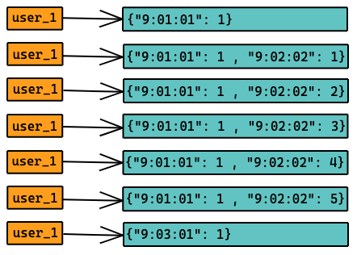

# Implementation

We will use

```` node-cache````


[](https://github.com/node-cache/node-cache/actions?query=workflow%3A"Node.js+CI"+branch%3A"master")  [](https://www.npmjs.com/package/node-cache) [](https://www.npmjs.com/package/node-cache) [](https://github.com/node-cache/node-cache/issues) [](https://coveralls.io/github/node-cache/node-cache)


when a user makes a request we fist see how many requests have been made in the past ````TIME-WINDOW````

if it is below the limit will will serve the user and 


> add the key- value to the table using ````myCache.set( key, val, [ ttl ] )````when its ttl or time to live hits zero thr key will be automatically deleted


Else if it is greater than 


> will will respond with an```` **HTTP** 429 Too Many Requests **response status code** ````indicating the user has sent too many requests in a given amount of time ("**rate limiting**").


# Design


### OBJECTIVES

- maximize client satisfaction
- minimize the cost attrition on our end
----
## Rate Limiter Algorithms
- ❌ Token Bucket ```` could lead to a race condition````
- ❌ Leaky Bucket ```` not good for a distributed system````
- ❌ Fixed Window Counter ```` allows more request than necessary````
- ❌ Sliding Logs ```` not great for scalable APIs````
- ✅Sliding Window Counter ````PERFECT for us````
----
> if I understand your business correctly, 
> you serve large cooperation and big-name clients 
> so the only source of error that would trigger the
> need to use rate limits would be a developer/architecture error
----
>we need to make sure that our AWS/GCP bills don't 
> rack up, at the same time we want to provide the best
> service for our clientele
----
inspiration from 

A. H. Fahim Raouf and J. Abouei, "Cache Replacement Scheme Based on Sliding Window and TTL for Video on Demand," Electrical Engineering (ICEE), Iranian Conference on, Mashhad, 2018, pp. 499-504, doi: 10.1109/ICEE.2018.8472723.

## decision
we will use the ````Sliding Window Counter```` method



Here the window time is broken down into smaller buckets — and the size of each bucket depends on the rate-limit threshold. Each bucket stores the request count corresponding to the bucket range, which constantly keeps moving across time, while smoothing outbursts of traffic.

When the sum of the counters with timestamps in the past time-slot exceeds the request threshold, User 1 has exceeded the rate limit.