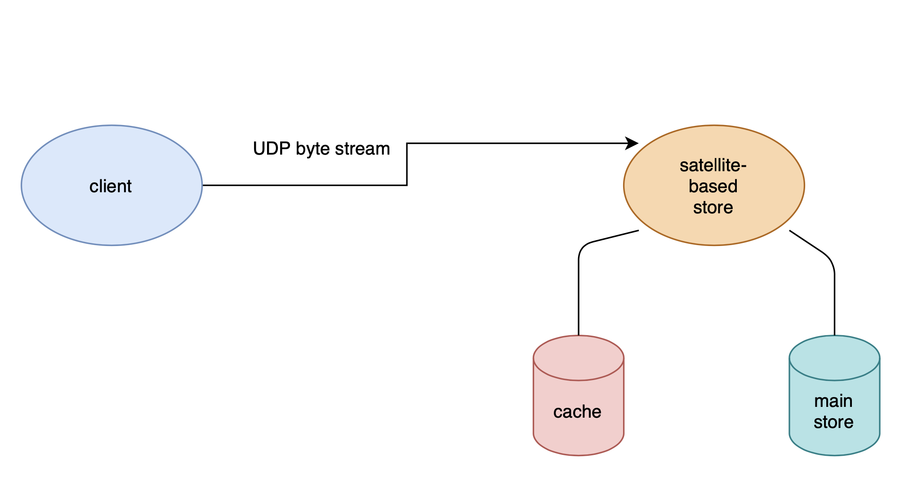

# Table of contents


## Deployment

The API endpoint is deployed at 

### ````http://bribchat.com:5555/````

(on my general purpose server in San Jose)

the rate is limited to 

### ```` 5 requests over 10 seconds```` 

refer to 

### ````ws-product-golang/README.md````

if you want to deploy and test it locally


## Implementation

We will use

### ```` node-cache````


when a user makes a request we fist see how many requests have been made in the past ````TIME-WINDOW````

if it is below the limit will will serve the user and


> add the key- value to the table using ````myCache.set( key, val, [ ttl ] )````when its ttl or time to live hits zero thr key will be automatically deleted


Else if it is greater than


> will will respond with an```` **HTTP** 429 Too Many Requests **response status code** ````indicating the user has sent too many requests in a given amount of time ("**rate limiting**").

## Design

### OBJECTIVES

- maximize client satisfaction
- minimize the cost attrition on our end

----

### Rate Limiter Algorithms

- ❌ Token Bucket ```` could lead to a race condition````
- ❌ Leaky Bucket ```` not good for a distributed system````
- ❌ Fixed Window Counter ```` allows more request than necessary````
- ❌ Sliding Logs ```` not great for scalable APIs````
- ✅Sliding Window Counter ````PERFECT for us````

> if I understand your business correctly,
> you serve large cooperation and big-name clients
> so the only source of error that would trigger the
> need to use rate limits would be a developer/architecture error


> we need to make sure that our AWS/GCP bills don't
> rack up, at the same time we want to provide the best
> service for our clientele

### decision

we will use the ````Sliding Window Counter```` method


Here the window time is broken down into smaller buckets — and the size of each bucket depends on the rate-limit
threshold. Each bucket stores the request count corresponding to the bucket range, which constantly keeps moving across
time, while smoothing outbursts of traffic.

When the sum of the counters with timestamps in the past time-slot exceeds the request threshold, User 1 has exceeded
the rate limit.

-------

# path 2b back end track

I have designed a robust/lightweight/fast/fault tolorent store using transport layer communication protocol (UDP) for inter node communication. I have also used Google's protocol buffers for genrating and sending these Key value pairs because it is much smaller and faster than XML. So lower cost on our end and more profit.


And the requirements


- Support counters by content selection and time, example counter Key `"sports:2020-01-08 22:01"`, Value `{views: 100, clicks: 4}`.
- Implement a mock store for storing counters. It can be in-memory, filesystem-based, or satellite-based (satellite not provided).
- Create go routine to upload counters to the mock store every 5 seconds.
- Global rate limit for stats handler.


### Deployment

Please refer to 

### ````ws-product-golang/README.md````


## Requirements

- fast
- cheap
- low memory footprint

## Design

### Communication

i will ditch the application layer communication system ````http````

in favour of transport layer communication   ````UDP````

- faster communication
- 100x lower cost

we will use

Google's protocol buffers on top of this


(https://www.researchgate.net/publication/311461272_Performance_evaluation_of_using_Protocol_Buffers_in_the_Internet_of_Things_communication)

### Architecture



The client will encode the message in GCP and send a udp bye stream to the server.

we will used IEEE checksum for maintinaing data intergrity

### Rate Limiter Algorithm

we will use the sliding window (without the log) rate limiting algorithm in this case

#### implementation

> we will have a go-cache in which we will store requests stack with a RATE_LIMIT time of expiration date  if there are more requests it will simply overflow and respond with http 429

> we will also have a go map to store the key values that are to be stored
>
> Every REFRESH_RATE we will send the Key value pairs to the server

